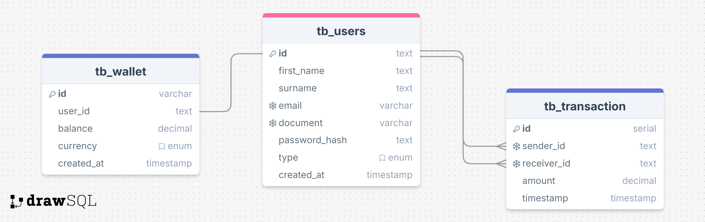

# PicPay Simplified - Back-End challenge

[🇧🇷 Versão em português](README-PT.md)

The goal of [this challenge](https://github.com/PicPay/picpay-desafio-backend) is implement a simplified version of PicPay service. It should be possible to **perform transfers between users**. This project adheres to **RESTful** principles and incorporates **clean code** practices, **observability**, and **SOLID**.

## 📌 Table of Contents

- [Project Overview](#-project-overview)
  - [Technologies Used](#️-technologies-used)
  - [Business Rules](#-business-rules)
  - [Requirements](#-requirements)
- [Features](#-features)
- [Setup Instructions](#️-setup-instructions)
  - [Prerequisites](#-prerequisites)
  - [Installation](#-installation)
  - [Usage](#-usage)
  - [Running Tests](#-running-tests)
- [Proposed Improvements](#-proposed-improvements)

## 📝 Project Overview

PicPay Simplified is a payment service that allows users to **transfer** and **deposit money**. It supports two types of users:

- **Customer:** Can send and receive money.
- **Merchants:** Can only receive money.

Each user has a wallet for transactions. The system ensures **security**, **validation**, and **reliability** during all financial operations.

### 🛠️ Technologies Used

- **Programming Language:** TypeScript
- **Framework:** Fastify
- **Database:** PostgreSQL
- **Caching:** Redis (Proposed)
- **Containerization:** Docker & Docker Compose
- **Documentation:** Swagger/OpenAPI
- **CI/CD:** GitHub Actions
- **Messaging:** RabbitMQ (Proposed)
- **Monitoring:** Prometheus, Grafana (Proposed)
- **Testing:** Vitest, supertest and Bruno for API testing

### 📋 Business Rules

- Email and CPF/CNPJ must be uniques
- Customers can receive and perform transfers
- Merchant only receive transfers
- Balance must be sufficient before transfers
- Every transfer operation is wrapped in a database transaction to ensure atomicity. In case of an error, the system reverts all operations to maintain consistency.
- Transfers must be authorized with an [external authorization service](https://util.devi.tools/api/v2/authorize) (GET)
- Users should receive a notification when a transfer is completed with a [external notification service](https://util.devi.tools/api/v1/notify) (POST)

### ✅ Requirements

- [x] User can create an account as customer or merchant
- [x] User can authenticate with email & password
- [x] Transaction history is available for all users
- [x] Customers can transfer money to other users (customers or merchants)
- [x] Transfers are restricted to customers with sufficient balance
- [x] All transfers must be authorized by an external service
- [x] Merchants are limited to receiving transfers only
- [ ] Users should receive notifications (e.g., email or SMS) upon receiving a transfer
- [x] Transfers must be reversible in case of any failure

## 📊 ER Diagram (Entity-Relationship)

The following diagram represents the database structure used in this project:



## ✨ Features

- [ ] **Secure transfers** between users.
- [x] Wallet **balance validation** before transactions.
- [x] Integration with external **authorization service** for validating transfers.
- [ ] **Notifications** for payees using a mocked external service.
- [x] **Rollback** mechanism for failed transactions.
- [ ] **Clean code** following **SOLID** principles.
- [ ] **Observability** with logging and monitoring.
- [ ] **Scalable** and **decoupled** architecture.
- [ ] **RESTful** API with Swagger documentation.
- [ ] Support for **relational** and **non-relational** databases.
- [ ] **Dockerized environment** for consistent deployment.
- [ ] Automated **CI/CD** pipelines.

## ⚙️ Setup Instructions

### 📌 Prerequisites

- Docker & Docker Compose
- Node v20+ with `pnpm` as package manager

### 🚀 Installation

1. **Clone the repository:**

    ```bash
    git clone https://github.com/patricks-js/picpay-simplified.git
    cd picpay-simplified
    ```

2. **Installing dependencies:**

    ```bash
    pnpm install
    ```

3. **Start the services:**

    ```bash
    pnpm services:up
    ```

4. **Running database migrations:**

    ```bash
    pnpm db:migrate
    ```

5. **Seed database with some data:**

    ```bash
    pnpm db:seed
    ```

### 💻 Usage

1. Start the application running:

    ```bash
    pnpm dev
    ```

2. The API will be accessible at <http://localhost:3333>
3. The API documentation (swagger) will be accessible at <http://localhost:3333/api/docs>

### 🧪 Running Tests

Run the following command

```bash
pnpm test
```

To see the code coverage

```bash
pnpm test:coverage
```

## 🌟 Proposed Improvements

- **Error Handling:** Enhance error messages and use semantic status codes.
- **Monitoring:** Add detailed transaction metrics for observability.
- **Rate Limiting:** Implement API rate limiting and request throttling for security.
- **Database Optimization:** Improve query performance with indexes and partitioning.
- **Caching:** Introduce caching strategies for high-volume transactions.
